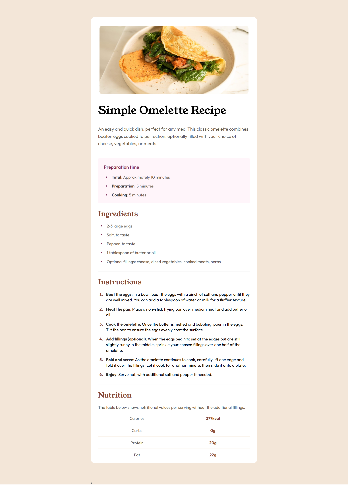
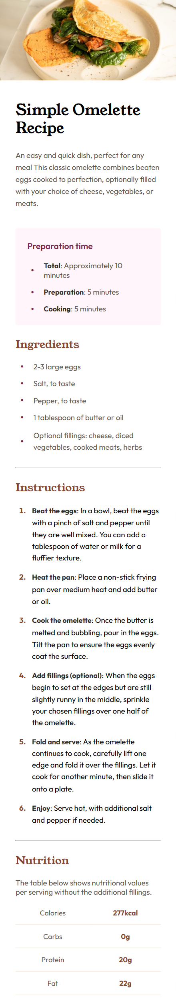

# Frontend Mentor - Recipe page solution

This is a solution to the [Recipe page challenge on Frontend Mentor](https://www.frontendmentor.io/challenges/recipe-page-KiTsR8QQKm). Frontend Mentor challenges help you improve your coding skills by building realistic projects.

## Table of contents

- [Overview](#overview)
  - [Screenshot](#screenshot)
  - [Links](#links)
- [My process](#my-process)
  - [Built with](#built-with)
  - [What I learned](#what-i-learned)
  - [Useful resources](#useful-resources)
- [Author](#author)

## Overview

### Screenshot




### Links

- Solution URL: [Add solution URL here](https://your-solution-url.com)
- Live Site URL: [Add live site URL here](https://your-live-site-url.com)

## My process

### Built with

- Semantic HTML5 markup
- CSS custom properties
- Flexbox
- Mobile-first workflow

### What I learned

I learned how to work with HTML lists and customize their appearance to fit the design I wanted. I practiced using both unordered lists (`<ul>`) and ordered lists (`<ol>`), and I used CSS to control spacing, bullet styles, and list item formatting.

To see how you can add code snippets, see below:

```css
ul li {
  position: relative;
  list-style-type: none;
  padding-left: 28px;
  color: var(--stone-600);
  font-size: clamp(1rem, 1vw + 0.3rem, 1.125rem);
}

ul li::before {
  content: "\2022";
  position: absolute;
  left: 0;
  font-size: 1.5em;
  line-height: 1;
  top: 50%;
  transform: translateY(-50%);
  color: var(--rose-800);
}
```

### Useful resources

- [MDN Web Docs](https://developer.mozilla.org/en-US/) - This is an essential resource that helped me understand how to style lists properly, including how to customize bullet points using `::marker` and how to apply spacing and alignment. I found their documentation clear and comprehensive, and I’ll continue using it for future CSS references.

## Author

- Website - [Add your name here](https://www.your-site.com)
- Frontend Mentor - [@Fady Mahrous](https://www.frontendmentor.io/profile/fadymas)
- Facebook - [@Fady Mahrous](https://www.facebook.com/fady.mahros.56/)
